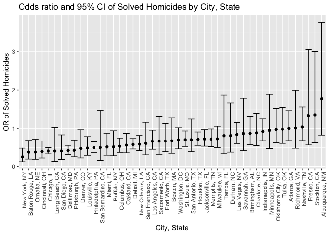

dxy2101_hw6_p8105
================
Daisy Yan
2022-12-03

``` r
library(tidyverse)
library(ggplot2)

set.seed(1)
```

## Problem 2

Load and prepare homicide data.

``` r
# Load data
url = 'https://raw.githubusercontent.com/washingtonpost/data-homicides/master/homicide-data.csv'

homicide_data = read_csv(url)

# Create new variables and clean
homicide_data =
  homicide_data %>%
  mutate(city_state = str_c(city, state, sep = ", "),
         status = case_when(
           disposition == "Closed without arrest" ~ "unsolved",
           disposition == "Open/No arrest" ~ "unsolved",
           disposition == "Closed by arrest" ~ "solved"
         )) %>%
  select(-city, -state, -disposition) %>%
  relocate(city_state, .before = lat) %>%
  subset(city_state != "Dallas, TX" & city_state != "Phoenix, AZ"
         & city_state != "Kansas City, MO" & city_state != "Tulsa, AL") %>%
  filter(victim_race == "White" | victim_race == "Black") %>%
  mutate(victim_age = as.numeric(victim_age))
```

For the city of Baltimore, MD, use the glm function to fit a logistic
regression with resolved vs unresolved as the outcome and victim age,
sex and race as predictors.

``` r
# Filter for Baltimore, MD
baltimore_df =
  homicide_data %>%
  filter(city_state == "Baltimore, MD") %>%
  mutate(
    resolved = as.numeric(status == "solved"),
    victim_race = fct_relevel(victim_race, "White")) %>% 
  select(resolved, victim_age, victim_race, victim_sex)

# Fit logistic regression
fit_logistic = 
  baltimore_df %>% 
  glm(resolved ~ victim_age + victim_race + victim_sex, data = ., family = binomial()) %>%
  broom::tidy(conf.int = TRUE)

# Obtain estimate and CI of OR
fit_logistic %>% 
  mutate(
    OR = exp(estimate),
    low.lim = exp(conf.low),
    up.lim = exp(conf.high)) %>%
  select(term, OR, low.lim, up.lim) %>% 
  knitr::kable(digits = 3)
```

| term             |    OR | low.lim | up.lim |
|:-----------------|------:|--------:|-------:|
| (Intercept)      | 3.164 |   1.998 |  5.057 |
| victim_age       | 0.993 |   0.987 |  1.000 |
| victim_raceBlack | 0.431 |   0.305 |  0.606 |
| victim_sexMale   | 0.426 |   0.324 |  0.558 |

The odds ratio for solving homicides comparing male victims to female
victims, controlling for age and race, is 0.426 (95% CI: 0.324, 0.558).

Now, run glm for each of the cities in your dataset, and extract the
adjusted odds ratio (and CI) for solving homicides comparing male
victims to female victims.

``` r
glm_cities = 
  homicide_data %>%
  mutate(
    resolved = as.numeric(status == "solved"),
    victim_race = fct_relevel(victim_race, "White")) %>%
  nest(data = -city_state) %>% 
  mutate(
    fit_logistic = map(data, ~glm(resolved ~ victim_age + victim_race + victim_sex, data = ., family = binomial())),
    output = map(.x = fit_logistic, ~broom::tidy(.x,conf.int = TRUE))) %>% 
  select(city_state, output) %>% 
  unnest(output) %>% 
  mutate(
    OR = exp(estimate),
    low.lim = exp(conf.low),
    up.lim = exp(conf.high)) %>%
  select(city_state, term, OR, low.lim, up.lim) %>%
  filter(term == "victim_sexMale")

glm_cities %>%
  knitr::kable(digits = 3)
```

| city_state         | term           |    OR | low.lim | up.lim |
|:-------------------|:---------------|------:|--------:|-------:|
| Albuquerque, NM    | victim_sexMale | 1.767 |   0.825 |  3.762 |
| Atlanta, GA        | victim_sexMale | 1.000 |   0.680 |  1.458 |
| Baltimore, MD      | victim_sexMale | 0.426 |   0.324 |  0.558 |
| Baton Rouge, LA    | victim_sexMale | 0.381 |   0.204 |  0.684 |
| Birmingham, AL     | victim_sexMale | 0.870 |   0.571 |  1.314 |
| Boston, MA         | victim_sexMale | 0.674 |   0.353 |  1.277 |
| Buffalo, NY        | victim_sexMale | 0.521 |   0.288 |  0.936 |
| Charlotte, NC      | victim_sexMale | 0.884 |   0.551 |  1.391 |
| Chicago, IL        | victim_sexMale | 0.410 |   0.336 |  0.501 |
| Cincinnati, OH     | victim_sexMale | 0.400 |   0.231 |  0.667 |
| Columbus, OH       | victim_sexMale | 0.532 |   0.377 |  0.748 |
| Denver, CO         | victim_sexMale | 0.479 |   0.233 |  0.962 |
| Detroit, MI        | victim_sexMale | 0.582 |   0.462 |  0.734 |
| Durham, NC         | victim_sexMale | 0.812 |   0.382 |  1.658 |
| Fort Worth, TX     | victim_sexMale | 0.669 |   0.394 |  1.121 |
| Fresno, CA         | victim_sexMale | 1.335 |   0.567 |  3.048 |
| Houston, TX        | victim_sexMale | 0.711 |   0.557 |  0.906 |
| Indianapolis, IN   | victim_sexMale | 0.919 |   0.678 |  1.241 |
| Jacksonville, FL   | victim_sexMale | 0.720 |   0.536 |  0.965 |
| Las Vegas, NV      | victim_sexMale | 0.837 |   0.606 |  1.151 |
| Long Beach, CA     | victim_sexMale | 0.410 |   0.143 |  1.024 |
| Los Angeles, CA    | victim_sexMale | 0.662 |   0.457 |  0.954 |
| Louisville, KY     | victim_sexMale | 0.491 |   0.301 |  0.784 |
| Memphis, TN        | victim_sexMale | 0.723 |   0.526 |  0.984 |
| Miami, FL          | victim_sexMale | 0.515 |   0.304 |  0.873 |
| Milwaukee, wI      | victim_sexMale | 0.727 |   0.495 |  1.054 |
| Minneapolis, MN    | victim_sexMale | 0.947 |   0.476 |  1.881 |
| Nashville, TN      | victim_sexMale | 1.034 |   0.681 |  1.556 |
| New Orleans, LA    | victim_sexMale | 0.585 |   0.422 |  0.812 |
| New York, NY       | victim_sexMale | 0.262 |   0.133 |  0.485 |
| Oakland, CA        | victim_sexMale | 0.563 |   0.364 |  0.867 |
| Oklahoma City, OK  | victim_sexMale | 0.974 |   0.623 |  1.520 |
| Omaha, NE          | victim_sexMale | 0.382 |   0.199 |  0.711 |
| Philadelphia, PA   | victim_sexMale | 0.496 |   0.376 |  0.650 |
| Pittsburgh, PA     | victim_sexMale | 0.431 |   0.263 |  0.696 |
| Richmond, VA       | victim_sexMale | 1.006 |   0.483 |  1.994 |
| San Antonio, TX    | victim_sexMale | 0.705 |   0.393 |  1.238 |
| Sacramento, CA     | victim_sexMale | 0.669 |   0.326 |  1.314 |
| Savannah, GA       | victim_sexMale | 0.867 |   0.419 |  1.780 |
| San Bernardino, CA | victim_sexMale | 0.500 |   0.166 |  1.462 |
| San Diego, CA      | victim_sexMale | 0.413 |   0.191 |  0.830 |
| San Francisco, CA  | victim_sexMale | 0.608 |   0.312 |  1.155 |
| St. Louis, MO      | victim_sexMale | 0.703 |   0.530 |  0.932 |
| Stockton, CA       | victim_sexMale | 1.352 |   0.626 |  2.994 |
| Tampa, FL          | victim_sexMale | 0.808 |   0.340 |  1.860 |
| Tulsa, OK          | victim_sexMale | 0.976 |   0.609 |  1.544 |
| Washington, DC     | victim_sexMale | 0.690 |   0.465 |  1.012 |

Create a plot that shows the estimated ORs and CIs for each city.

``` r
glm_cities %>% 
  mutate(city_state = fct_reorder(city_state, OR)) %>% 
  ggplot(aes(x = city_state, y = OR)) + geom_point() + 
  geom_errorbar(aes(ymin = low.lim, ymax = up.lim), width = 1) +
  theme(axis.text.x = element_text(angle = 90, hjust = 1)) +
  xlab("City, State") + ylab("OR of Solved Homicides") +
  ggtitle("Odds ratio and 95% CI of Solved Homicides by City, State")
```

<!-- -->

According to the plot, New York, NY has the lowest odds ratio for
solving homicides comparing male victims to female victims, controlling
for age and race, while Albuquerque, NM has the highest odds ratio for
solving homicides comparing male victims to female victims, controlling
for age and race. Albuquerque, NM also has the greatest 95% confidence
interval for the odds ratio, suggesting greater variability in its data.
